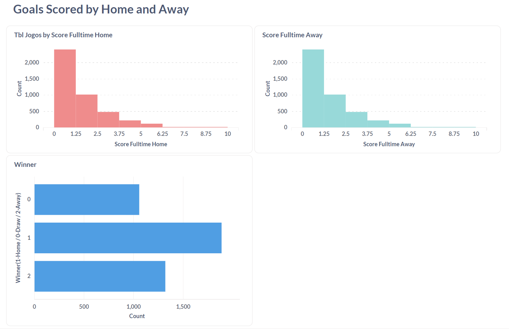

Football Stats - Data Engineering Project

# Introduction
The Project consists in the analysis of football/soccer results of the main european leagues in seasons 2020/2021 and 2021/2022.
Starting from a source of CSV files with match results by season, the final goal is calculating some statistics regarding theses matches, as well as building league tables bases on the match data.

The data used (in CSV files) comes from a paid API that I am using for another project, and therefore the code to retrieve the code from the API is not included in this project.
However, in order to allow the reproducibility, I include in this repo the 2 CSV files used in the project.
The format of the CSV files is quite simple, and therefore it would be easy to get data for more seasons/leagues from other sources if needed.

# Tools/Technologies used

1. Python
2. Terraform
3. Google Cloud Platform (Cloud Storage and BigQuery)
4. dbt
5. metabase

# Pipeline
The main steps followed were:
1. Used Terraform to create infrastructure (Cloud Storage and BigQuery) in GCP
2. Uploaded CSV files with match results (by season) to Cloud Storage bucket
3. Used Python to read CSV files with match results from Cloud Storage bucket and upload the data to BigQuery
4. Used dbt to read match results from BigQuery, calculating league tables, and upload them back as a View to BigQuery
5. Used metabase to connect to BigQuery and create a dashboard with match stats and league tables

# Dashboard

# Reproducing the Repo
The repo includes all code used and the source CSVs, and therefore should allow for easy reproducibility.
- terraform folder includes the files used for creating the necessary infrastructure in GCP. Variables needed can be checked in file "variables-example.tf"
- The CSV files included are ready to be placed in a bucket, and included is also the the code used to read these files and load the data into BigQuery (``python/cloud_storage_to_bigquery.ipynb``)

I include the code I used to read these files and load the data into BigQuery (file )
After the data is BigQuery, dbt can be used to calculate the league tables. The model used is included in dbt/models/league_tables.sql.
Finally